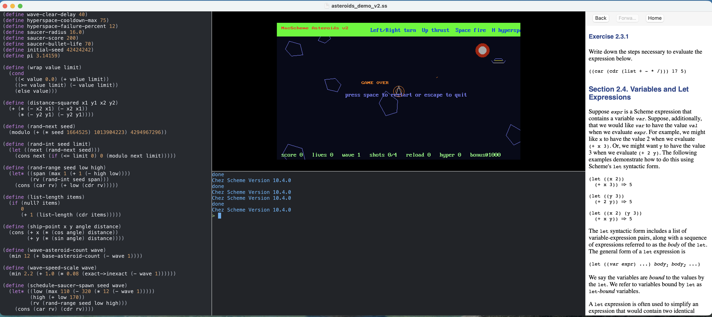

# MacScheme

Part of the Unplug and code series of compiler projects.




Welcome to **MacScheme**! This project transforms your modern Mac into a dedicated, 1980s-style Scheme workstation. 

Scheme is a beautiful language that captures some essential essence of reality, and coding in it should be a fun, immersive experience. MacScheme is designed to provide exactly that: an environment where you can explore the elegance of Scheme without modern distractions.  

## Features

* **Retro Workstation Vibe**: A minimal, distraction-free appearance that lets you turn off the internet go full screen and pretend your Mac is a classic Lisp machine from 1981s. (to some extent)

* **Structured Editor**: Building on the tiled pane ideas of my earlier Scheme Shells for Windows, MacScheme features a completely rewritten and much better structured editor tailored for Lisp editing.

* **Retro Graphics & Sound**: Includes built-in support for hardware-accelerated (via Metal) but retro-flavored graphics (software blitting, indexed palettes, off-screen buffers for parallax scrolling, gpu driven sprites) and a fun sound API, making it easy to build retro games, creative coding sketches, and interactive art directly in Scheme.

## Powered by Chez Scheme

MacScheme wouldn't be possible without **Chez Scheme**. Chez Scheme is an incredibly fast, robust, and mature implementation of Scheme that compiles to optimized native machine code. It forms the foundation of this project and executes all of the Scheme code you write within the editor. A huge amount of credit goes to the Chez Scheme authors and maintainers for such a stellar and historically significant compiler, as well as the modern schemers who have been contributing to it recently.

## offline docs, from Chez Scheme 

You could learn scheme from reading the Scheme books, offline, and try the examples, no internet necessary.

## Building on macOS

To build MacScheme from source, you will need macOS and the [Zig compiler](https://ziglang.org/). 

1. Clone the repository to your local machine:
   ```bash
   git clone git@github.com:albanread/MacScheme.git
   cd MacScheme
   ```

2. To build the project, change into the `MacScheme` directory and use Zig:
   ```bash
   cd MacScheme
   zig build
   ```

   Homebrew's `chezscheme` formula installs the exact static archives this project expects. If `MacScheme/lib/xxxxxx` is empty, you can populate it with:
   ```bash
   brew install chezscheme
   cp "$(brew --prefix chezscheme)"/lib/csv*/ta6osx/libkernel.a MacScheme/lib/intel64/
   cp "$(brew --prefix chezscheme)"/lib/csv*/ta6osx/liblz4.a MacScheme/lib/intel64/
   cp "$(brew --prefix chezscheme)"/lib/csv*/ta6osx/libz.a MacScheme/lib/intel64/
   cp "$(brew --prefix chezscheme)"/lib/csv*/ta6osx/petite.boot MacScheme/resources/intel64/
   cp "$(brew --prefix chezscheme)"/lib/csv*/ta6osx/scheme.boot MacScheme/resources/intel64/
   ```

   The Intel package must use the matching Chez boot files as well as the Intel static archives. After that, package an Intel build with:
   ```bash
   ./package.sh intel64
   ```

   The arm64 version has its own folders as well.


3. Alternatively, to build, package the macOS `.app` bundle, and deep-sign it, you can run the provided packaging scripts in the root directory:
   ```bash
   ./package.sh
   ./run.sh
   ```

 Intel performance gap  

Some Intel Macs have challenges with some of the graphics blitting instructions, which needs further investigation.

## Getting Started

Once launched, use the editor to write your Scheme expressions, evaluate them, and enjoy the minimalist aesthetic as you hack away at retro graphics buffers, audio, and more. 

Have fun exploring the beauty of Scheme!

## License

This project is licensed under the MIT License.
