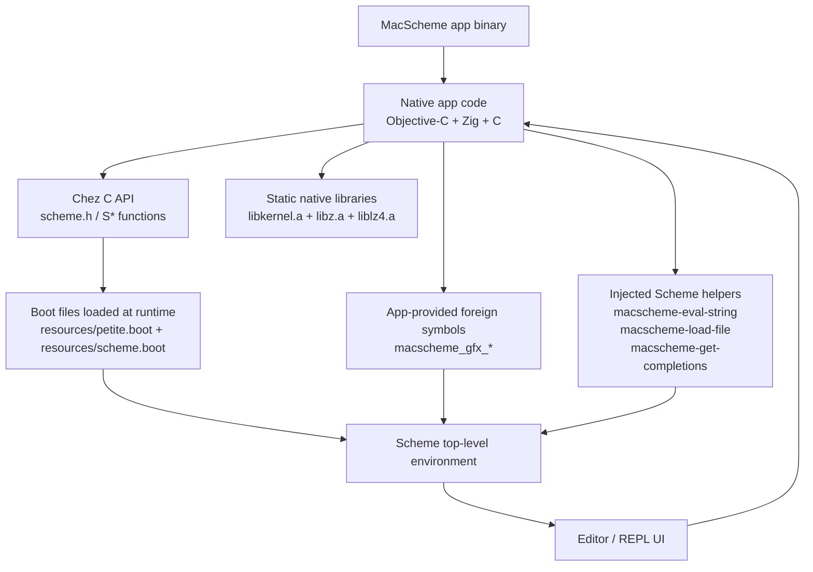
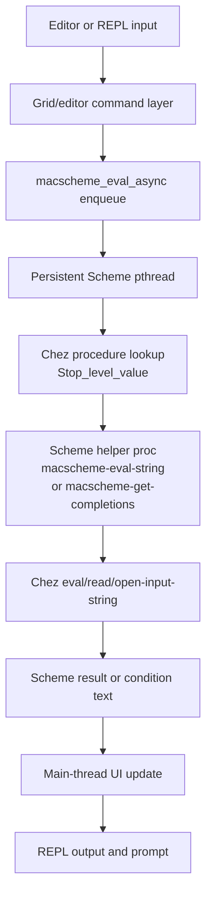

# Chez linkage and runtime boundary

This note describes what the MacScheme app links natively from Chez-related artifacts, what it loads at runtime, and what native functions it exposes back into Scheme.

## Graph

## What is linked into the app

The build links native Chez/runtime support libraries into the executable:

- [MacScheme/build.zig](MacScheme/build.zig) adds the library search path `MacScheme/lib`
- The linked native libraries are:
  - [MacScheme/lib/libkernel.a](MacScheme/lib/libkernel.a)
  - [MacScheme/lib/libz.a](MacScheme/lib/libz.a)
  - [MacScheme/lib/liblz4.a](MacScheme/lib/liblz4.a)
- The app includes Chez's C API header in [MacScheme/src/app_delegate.m](MacScheme/src/app_delegate.m#L1-L7) via `scheme.h`

In other words, the app is natively linked against the Chez runtime layer and calls it through the `S...` API.

## What is loaded at runtime

The Scheme world itself is brought up by loading boot images at startup, not by linking Scheme source files into the app:

- [MacScheme/resources/petite.boot](MacScheme/resources/petite.boot)
- [MacScheme/resources/scheme.boot](MacScheme/resources/scheme.boot)

Startup happens in [MacScheme/src/app_delegate.m](MacScheme/src/app_delegate.m#L968-L978):

- `Sscheme_init(NULL)` initializes the runtime
- `Sregister_boot_file(...)` registers each boot image
- `Sbuild_heap(NULL, NULL)` builds the running Scheme heap

## What the app exports into Scheme

After startup, the app registers a large native foreign-function surface so Scheme code can call back into the host app. This happens in [MacScheme/src/app_delegate.m](MacScheme/src/app_delegate.m#L994-L1043).

These foreign symbols are primarily the graphics bridge, including:

- `macscheme_gfx_init`
- `macscheme_gfx_screen`
- `macscheme_gfx_pset`
- `macscheme_gfx_line`
- `macscheme_gfx_rect`
- `macscheme_gfx_circle`
- `macscheme_gfx_blit`
- `macscheme_gfx_palette`
- `macscheme_gfx_draw_text`
- `macscheme_gfx_flip`
- `macscheme_gfx_vsync`
- buffer/screen query functions

So the direction is:

- App starts Chez
- App registers native functions with `Sforeign_symbol(...)`
- Scheme code can then call those names as foreign procedures

## What the app injects as Scheme helpers

The app also constructs and installs a few Scheme-level helper procedures at runtime in [MacScheme/src/app_delegate.m](MacScheme/src/app_delegate.m#L1044-L1066):

- `macscheme-eval-string`
- `macscheme-load-file`
- `macscheme-get-completions`

These are not linked files. They are Scheme lambdas created from strings, evaluated, and stored in the top-level environment.

## Practical summary

The boundary is:

1. Native app code is compiled and linked into the MacScheme executable
2. Native Chez runtime support libraries are linked into that executable
3. Scheme boot images are loaded from resources at runtime
4. The app exposes native entry points back into Scheme using `Sforeign_symbol(...)`
5. The editor/REPL uses those facilities to evaluate code and drive graphics functionality

## Evaluation flow

The runtime path is:

- The editor or REPL gathers text input and routes it into the app command layer
- The app enqueues work for the dedicated Scheme thread
- That thread looks up helper bindings like `macscheme-eval-string` or `macscheme-get-completions`
- The helper procedure performs `read`/`eval` inside the Chez interaction environment
- The result or formatted exception text is passed back to the UI
- The main thread appends output and restores the prompt

This is why the app can keep all Chez API calls on one owned thread while still presenting a responsive Cocoa UI.

## Objective-C entry points

The main native entry points for this flow live in [MacScheme/src/app_delegate.m](MacScheme/src/app_delegate.m):

- [scheme_enqueue](MacScheme/src/app_delegate.m#L32-L49) pushes eval/completion work onto the shared Scheme request queue
- [scheme_dequeue](MacScheme/src/app_delegate.m#L52-L60) pops the next request for the owned Scheme thread
- [EvaluateSchemeExpression](MacScheme/src/app_delegate.m#L651-L679) calls the installed `macscheme-eval-string` helper and normalizes the result
- [EvaluateSchemeCompletions](MacScheme/src/app_delegate.m#L684-L704) calls `macscheme-get-completions` and converts the returned list to Cocoa strings
- [macscheme_eval_async](MacScheme/src/app_delegate.m#L708-L711) is the C-facing enqueue hook used by the editor/REPL path for evaluation
- [macscheme_get_completions](MacScheme/src/app_delegate.m#L713-L716) is the enqueue hook for completion requests
- [scheme_thread_entry](MacScheme/src/app_delegate.m#L724-L781) owns the Chez thread, runs initialization, executes queued requests, and dispatches results back to the main thread
- [initScheme](MacScheme/src/app_delegate.m#L968-L1078) initializes Chez, registers boot files, installs foreign symbols, and creates the helper Scheme procedures

The user-visible Objective-C actions that trigger editor evaluation are also in [MacScheme/src/app_delegate.m](MacScheme/src/app_delegate.m):

- [evaluateSelectionOrForm:](MacScheme/src/app_delegate.m#L849-L852)
- [evaluateTopLevelForm:](MacScheme/src/app_delegate.m#L854-L857)
- [evaluateBuffer:](MacScheme/src/app_delegate.m#L859-L862)

Those actions route into the grid/editor layer, which then calls back into the async Scheme bridge.
